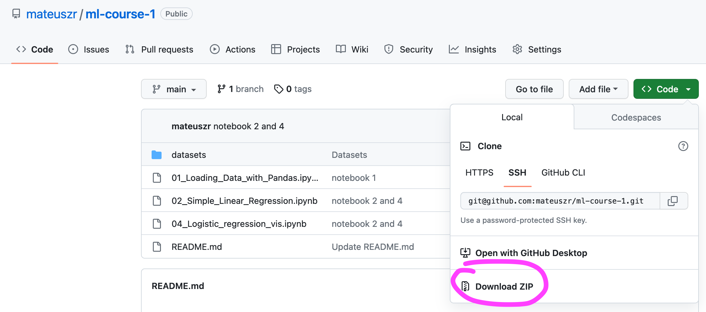
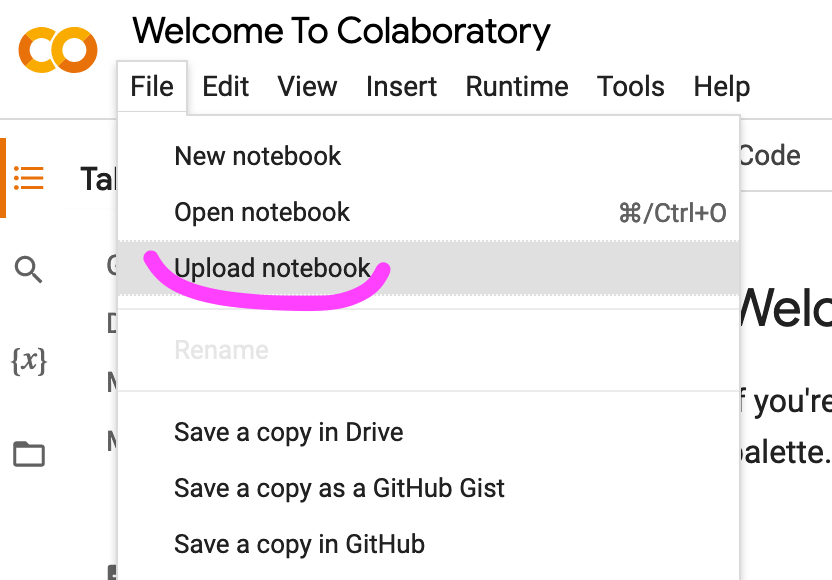
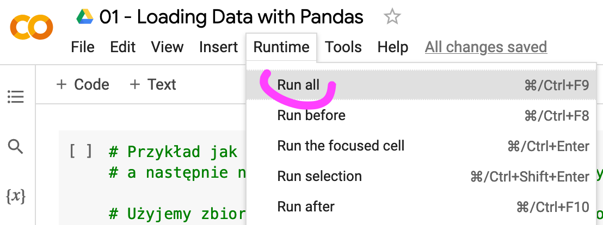

# Podstawy uczenia maszynowego

Materiały do kursu "Podstawy uczenia maszynowego".

- Prezentacje będą pojawiały się w folderze [presentations](presentations).
- Notebooki są w katalogu głównym.
- W katalogu [datasets](datasets) będę umieszczał zbiory danych wykorzystywane w naszym kursie.

Zalecam pobrać całe repozytorium na dysk. Najszybciej można to zrobić w następujący sposób:

## Jak pracować z Notebookami

Notebooki (pliki z rozszerzeniem *.ipynb) można uruchamiać w serwisie Google Colaboratory: https://colab.research.google.com/ 

W tym celu trzeba założyć konto Google (np. gmail) i przejść na stronę [Google Colab](https://colab.research.google.com/).

Następnie możemy wysłać dowolny notebook z naszeg kursu przy pomocy Menu File -> Upload. 

Po wysłaniu notebooka możemy uruchomić wszytskie komórki wybierając menu Runtime -> Run all 

## Kilka wskazówek przy pracy z Google Colab

- wszytskie pliki które wyślemy do notebooka (np. pliki z danymi) przepadną po zamknięciu. Nie dotyczy to samych notebooków
- najlepiej ładować pliki csv z internetu (lokalizacji HTTP)
- można też użyć google drive do przechowywania rzeczy. w notebooku '01 - Loading Data with Pandas' jest instrukcja jak to zrobić.
- każdą komórkę notebooka można uruchomić oddzielnie ale warto co jakiś czas uruchomić cały notebook (Runtime -> Run all)